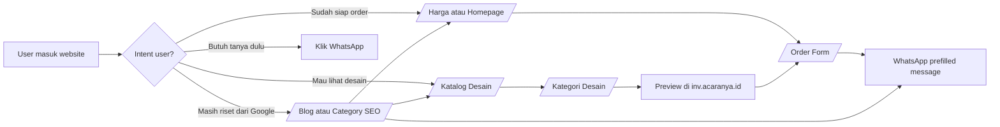
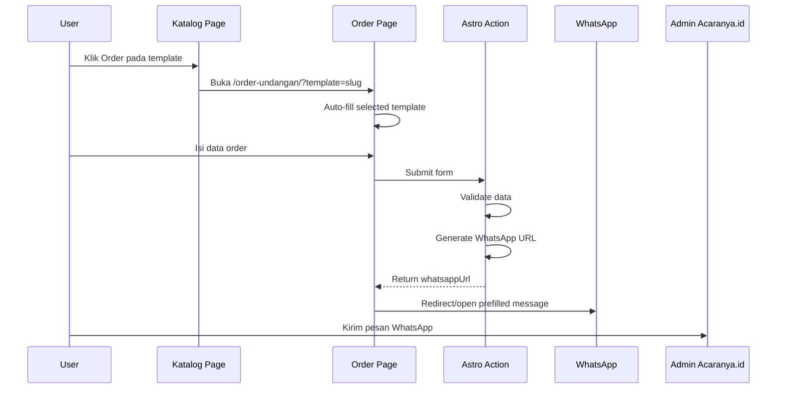
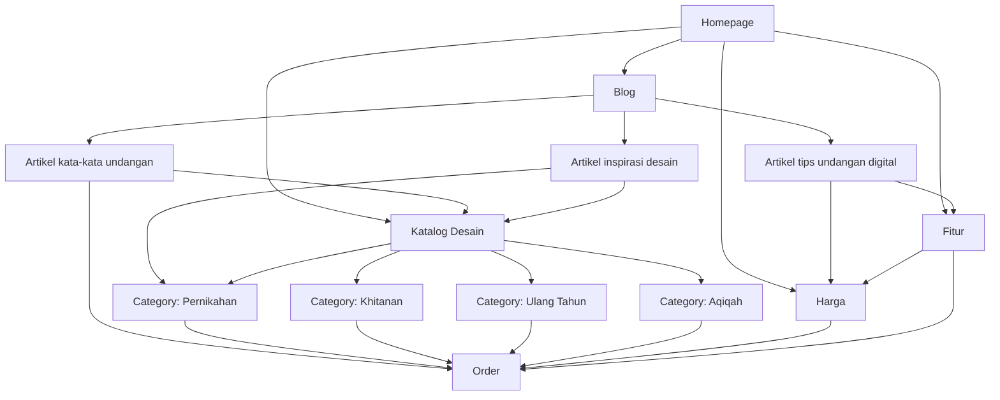

# Frontend Plan — UI/UX, Navigasi, Wireframe, dan SEO Architecture

# Acaranya.id Astro Website

**Versi:** 1.0  
**Fokus:** Frontend architecture, UI/UX, navigasi, layout, SEO-ready information architecture  
**Brand accent:** `#4d5859`  
**Visual direction:** clean, editorial, elegant, modern, warm, mobile-first  
**Font direction:** Inter + Cormorant Garamond + Allura

---

## 1. Prinsip Utama Frontend

Website Acaranya.id harus dibangun sebagai **marketing website yang cepat, cantik, dan conversion-oriented**, bukan sekadar company profile. Setiap halaman harus punya tujuan jelas: memberi informasi, membangun trust, lalu mengarahkan user ke katalog, order form, atau WhatsApp.

### 1.1 Frontend Principles

1. **Mobile-first.** Mayoritas user kemungkinan datang dari WhatsApp, Instagram, TikTok, atau pencarian Google via mobile.
2. **SEO-first, bukan filter-first.** Halaman kategori dan artikel harus indexable. Filter/search katalog boleh interaktif, tetapi tidak boleh mengorbankan crawlability.
3. **Content above interaction.** Informasi penting harus ada di HTML static, bukan baru muncul setelah JavaScript berjalan.
4. **Fast visual decision.** User harus bisa melihat kualitas desain dalam 1–2 scroll pertama.
5. **Clear CTA hierarchy.** Setiap halaman punya primary CTA dan secondary CTA.
6. **Elegant but not fragile.** Desain harus premium, tapi tetap mudah di-maintain lewat reusable tokens dan components.
7. **Avoid over-animation.** Motion dipakai untuk memperjelas flow, bukan untuk dekorasi berlebihan.

---

## 2. UI/UX Strategy

## 2.1 Desired First Impression

Saat user membuka website, kesan yang harus muncul:

- “Ini brand undangan digital yang rapi dan terpercaya.”
- “Desainnya cantik, bukan template asal-asalan.”
- “Harganya jelas.”
- “Saya bisa preview dulu sebelum order.”
- “Kalau bingung, bisa langsung WhatsApp.”

## 2.2 Visual Mood

```txt
Elegant       : serif heading, soft spacing, premium mockup
Modern        : clean card, clear CTA, responsive layout
Warm          : cream background, gentle copywriting
Trustworthy   : clear pricing, testimonial, FAQ, legal links
Fast          : simple navigation, obvious order path
```

## 2.3 Visual Composition

Website sebaiknya memakai kombinasi:

- Background warm ivory/cream.
- Surface putih untuk card.
- Border soft champagne/neutral.
- Brand color `#4d5859` untuk CTA dan aksen.
- Serif display untuk headline.
- Sans-serif untuk body dan UI.
- Decorative latin font hanya untuk detail kecil.

### Recommended Visual Ratio

```txt
70% neutral warm background / white surface
20% brand color #4d5859
8% champagne/gold accent
2% decorative flourish / latin accent
```

---

## 3. UX Conversion Strategy

## 3.1 Main Conversion Paths

Ada tiga jalur utama user:

1. **User sudah siap order**  
   Home → Harga/Katalog → Order Form → WhatsApp

2. **User ingin lihat desain dulu**  
   Home → Katalog → Preview subdomain → Order

3. **User masih riset dari Google**  
   Blog/Kategori SEO → Katalog/Fitur/Harga → WhatsApp/Order

## 3.2 CTA Hierarchy

### Primary CTA

```txt
Lihat Desain
Order Sekarang
Pilih Template
```

### Secondary CTA

```txt
Konsultasi WhatsApp
Lihat Harga
Pelajari Fitur
```

### Global CTA Rules

- Header desktop: primary CTA “Order Sekarang”.
- Header mobile: CTA masuk ke drawer dan floating WhatsApp tetap tersedia.
- Floating WhatsApp tampil di semua halaman kecuali saat user sedang berada di form order, agar tidak mengganggu fokus.
- Pada katalog, setiap card punya dua CTA: “Preview” dan “Order”.
- Pada pricing, setiap paket punya CTA dengan query package.

---

## 4. Navigation Architecture

## 4.1 Desktop Navigation

```txt
Logo | Fitur | Harga | Desain | Blog | Kontak | [Order Sekarang]
```

### Desktop Header Behavior

- Sticky atau sticky-on-scroll-up.
- Background transparan di hero boleh, tetapi berubah menjadi solid saat scroll.
- Logo kiri.
- Menu tengah/kiri.
- CTA kanan.
- Height sekitar 72–80px desktop.

## 4.2 Mobile Navigation

Mobile tidak boleh hanya meniru desktop. Mobile harus fokus ke action.

```txt
[Logo]                         [Menu]
```

Drawer content:

```txt
Home
Fitur
Harga
Desain Undangan
Blog
Tentang
Kontak

[Order Sekarang]
[Chat WhatsApp]
```

### Mobile UX Rule

- Hamburger harus mudah ditekan.
- Drawer full-height atau bottom sheet.
- CTA di drawer harus terlihat tanpa scroll panjang.
- Floating WhatsApp di kanan bawah.
- Hindari banyak dropdown di mobile.

## 4.3 Footer Navigation

Footer berfungsi untuk SEO internal linking dan trust.

```txt
Brand
- Short description
- WhatsApp
- Email

Layanan
- Undangan Digital
- Undangan Pernikahan
- Undangan Khitanan
- Undangan Ulang Tahun
- Undangan Aqiqah

Perusahaan
- Tentang
- Kontak
- Blog

Bantuan
- Harga
- Fitur
- FAQ
- Syarat & Ketentuan
- Kebijakan Privasi
```

## 4.4 Breadcrumb Strategy

Breadcrumb wajib untuk:

- Katalog kategori.
- Blog detail.
- Blog kategori.
- Legal page.

Contoh:

```txt
Home / Desain Undangan Digital / Pernikahan
Home / Blog / Contoh Kata-Kata Undangan Digital
```

Breadcrumb membantu UX dan bisa digunakan untuk `BreadcrumbList` schema.

---

## 5. SEO-Ready Site Architecture

## 5.1 SEO Page Types

```txt
Homepage                      : brand + commercial landing
Fitur                         : commercial informational
Harga                         : commercial decision page
Katalog Desain                : commercial collection page
Kategori Desain               : SEO collection page
Blog Index                    : content hub
Blog Detail                   : long-tail SEO article
Kontak                        : trust + conversion
Tentang                       : trust page
Legal                         : trust/supporting page
```

## 5.2 Indexing Strategy

### Should be indexable

```txt
/
/fitur/
/harga/
/desain-undangan-digital/
/desain-undangan-digital/kategori/pernikahan/
/desain-undangan-digital/kategori/khitanan/
/desain-undangan-digital/kategori/ulang-tahun/
/desain-undangan-digital/kategori/aqiqah/
/blog/
/blog/[slug]/
/kontak/
/tentang/
```

### Should generally not create indexable variations

```txt
/desain-undangan-digital/?search=elegant
/desain-undangan-digital/?style=gold&package=meriah
/desain-undangan-digital/?sort=latest
```

Filter/search query pages should canonicalize to the main katalog page or category page, unless a specific filter becomes a real landing page.

## 5.3 SEO Content Placement for Catalog

Katalog tidak boleh hanya grid card. Halaman harus punya static SEO content.

Recommended structure:

```txt
Hero H1
Short SEO intro
Category internal links
Template grid
How to order section
FAQ section
SEO paragraph bottom
Final CTA
```

This keeps the page useful for both users and search engines.

## 5.4 Heading Structure Rule

Each page:

```txt
One H1 only
H2 for main sections
H3 for cards/subsections
No heading jump for visual styling only
```

Example `/desain-undangan-digital/`:

```txt
H1: Desain Undangan Digital Siap Pakai untuk Berbagai Acara
H2: Pilih Kategori Acara
H2: Template Undangan Digital Terbaru
H2: Cara Order Undangan Digital di Acaranya.id
H2: Pertanyaan Seputar Desain Undangan Digital
```

---

# 6. ASCII Wireframe — Global Layout

## 6.1 Desktop Header

```txt
┌──────────────────────────────────────────────────────────────────────────────┐
│ LOGO Acaranya.id       Fitur   Harga   Desain   Blog   Kontak    [Order]    │
└──────────────────────────────────────────────────────────────────────────────┘
```

## 6.2 Mobile Header

```txt
┌──────────────────────────────┐
│ LOGO Acaranya.id        ☰    │
└──────────────────────────────┘
```

## 6.3 Mobile Drawer

```txt
┌──────────────────────────────┐
│ LOGO Acaranya.id        X    │
├──────────────────────────────┤
│ Home                         │
│ Fitur                        │
│ Harga                        │
│ Desain Undangan              │
│ Blog                         │
│ Tentang                      │
│ Kontak                       │
├──────────────────────────────┤
│ [Order Sekarang]             │
│ [Chat WhatsApp]              │
└──────────────────────────────┘
```

## 6.4 Footer

```txt
┌──────────────────────────────────────────────────────────────────────────────┐
│ Acaranya.id                                                                  │
│ Undangan digital modern untuk berbagai acara.                                │
│                                                                              │
│ Layanan              Perusahaan            Bantuan             Kontak         │
│ - Pernikahan         - Tentang             - Harga             WhatsApp       │
│ - Khitanan           - Blog                - Fitur             Email          │
│ - Ulang Tahun        - Kontak              - FAQ               Instagram      │
│ - Aqiqah                                  - Legal                            │
│                                                                              │
│ © Acaranya.id                                                                │
└──────────────────────────────────────────────────────────────────────────────┘
```

---

# 7. ASCII Wireframe — Homepage

## 7.1 Homepage Desktop

```txt
┌──────────────────────────────────────────────────────────────────────────────┐
│ HEADER                                                                       │
├──────────────────────────────────────────────────────────────────────────────┤
│                                                                              │
│  HERO                                                                        │
│  ┌──────────────────────────────────┐    ┌───────────────────────────────┐   │
│  │ small latin/accent eyebrow        │    │                               │   │
│  │ H1: Undangan digital cantik       │    │    Phone mockup / template     │   │
│  │     untuk momen spesialmu         │    │    preview stack               │   │
│  │ Body copy                         │    │                               │   │
│  │ [Lihat Desain] [WhatsApp]         │    │                               │   │
│  │ Trust microcopy                   │    │                               │   │
│  └──────────────────────────────────┘    └───────────────────────────────┘   │
│                                                                              │
├──────────────────────────────────────────────────────────────────────────────┤
│ TRUST STATS                                                                  │
│ [2000+ undangan] [150k+ tamu] [200+ desain] [Sejak 2022]                     │
├──────────────────────────────────────────────────────────────────────────────┤
│ FEATURED DESIGNS                                                             │
│ H2 + short intro                                          [Lihat Semua]       │
│ ┌────────────┐ ┌────────────┐ ┌────────────┐ ┌────────────┐                  │
│ │ design card│ │ design card│ │ design card│ │ design card│                  │
│ └────────────┘ └────────────┘ └────────────┘ └────────────┘                  │
├──────────────────────────────────────────────────────────────────────────────┤
│ WHY ACARANYA                                                                 │
│ ┌────────────┐ ┌────────────┐ ┌────────────┐                                 │
│ │ Cepat      │ │ Fitur      │ │ Mudah      │                                 │
│ └────────────┘ └────────────┘ └────────────┘                                 │
├──────────────────────────────────────────────────────────────────────────────┤
│ HOW IT WORKS                                                                 │
│ 01 Pilih desain  →  02 Kirim data  →  03 Review  →  04 Bagikan              │
├──────────────────────────────────────────────────────────────────────────────┤
│ PRICING PREVIEW                                                              │
│ ┌────────────┐ ┌────────────┐ ┌────────────┐                                 │
│ │ Simple     │ │ Mengundang │ │ Meriah     │                                 │
│ └────────────┘ └────────────┘ └────────────┘                                 │
├──────────────────────────────────────────────────────────────────────────────┤
│ TESTIMONIALS                                                                 │
│ ┌────────────────┐ ┌────────────────┐ ┌────────────────┐                    │
│ │ Quote card      │ │ Quote card      │ │ Quote card      │                    │
│ └────────────────┘ └────────────────┘ └────────────────┘                    │
├──────────────────────────────────────────────────────────────────────────────┤
│ FAQ PREVIEW                                                                  │
│ Accordion/list                                                               │
├──────────────────────────────────────────────────────────────────────────────┤
│ FINAL CTA                                                                    │
│ H2 + copy + [Lihat Desain] [Order WhatsApp]                                  │
├──────────────────────────────────────────────────────────────────────────────┤
│ FOOTER                                                                       │
└──────────────────────────────────────────────────────────────────────────────┘
```

## 7.2 Homepage Mobile

```txt
┌──────────────────────────────┐
│ HEADER                       │
├──────────────────────────────┤
│ HERO                         │
│ small accent                 │
│ H1                           │
│ Body                         │
│ [Lihat Desain]               │
│ [WhatsApp]                   │
│ Phone mockup                 │
├──────────────────────────────┤
│ TRUST STATS                  │
│ 2x2 stat grid                │
├──────────────────────────────┤
│ FEATURED DESIGNS             │
│ horizontal scroll or 1-col   │
├──────────────────────────────┤
│ WHY ACARANYA                 │
│ stacked cards                │
├──────────────────────────────┤
│ HOW IT WORKS                 │
│ vertical steps               │
├──────────────────────────────┤
│ PRICING                      │
│ stacked pricing cards        │
├──────────────────────────────┤
│ FAQ                          │
├──────────────────────────────┤
│ FINAL CTA                    │
├──────────────────────────────┤
│ FOOTER                       │
└──────────────────────────────┘
```

---

# 8. ASCII Wireframe — Katalog Desain

## 8.1 Catalog Desktop

```txt
┌──────────────────────────────────────────────────────────────────────────────┐
│ HEADER                                                                       │
├──────────────────────────────────────────────────────────────────────────────┤
│ BREADCRUMB: Home / Desain Undangan Digital                                  │
├──────────────────────────────────────────────────────────────────────────────┤
│ CATALOG HERO                                                                 │
│ H1: Desain Undangan Digital Siap Pakai                                      │
│ Intro SEO copy                                                               │
│ [Pernikahan] [Khitanan] [Ulang Tahun] [Aqiqah] [Corporate]                  │
├──────────────────────────────────────────────────────────────────────────────┤
│ FILTER BAR                                                                   │
│ ┌────────────────────────────┐ ┌──────────────┐ ┌──────────────┐             │
│ │ Search template             │ │ Kategori      │ │ Paket        │             │
│ └────────────────────────────┘ └──────────────┘ └──────────────┘             │
├──────────────────────────────────────────────────────────────────────────────┤
│ RESULTS META                                                                 │
│ 128 desain tersedia                                      Sort: Featured       │
├──────────────────────────────────────────────────────────────────────────────┤
│ DESIGN GRID                                                                  │
│ ┌────────────┐ ┌────────────┐ ┌────────────┐ ┌────────────┐                  │
│ │ Thumbnail  │ │ Thumbnail  │ │ Thumbnail  │ │ Thumbnail  │                  │
│ │ Title      │ │ Title      │ │ Title      │ │ Title      │                  │
│ │ Badge/tag  │ │ Badge/tag  │ │ Badge/tag  │ │ Badge/tag  │                  │
│ │[Preview][Order] each card                                      │            │
│ └────────────┘ └────────────┘ └────────────┘ └────────────┘                  │
│ ┌────────────┐ ┌────────────┐ ┌────────────┐ ┌────────────┐                  │
│ │ card       │ │ card       │ │ card       │ │ card       │                  │
│ └────────────┘ └────────────┘ └────────────┘ └────────────┘                  │
├──────────────────────────────────────────────────────────────────────────────┤
│ PAGINATION                                                                   │
│ < Prev   1  2  3  4   Next >                                                 │
├──────────────────────────────────────────────────────────────────────────────┤
│ SEO CONTENT                                                                  │
│ H2: Pilih desain undangan digital sesuai acaramu                             │
│ Paragraph + internal links                                                   │
├──────────────────────────────────────────────────────────────────────────────┤
│ HOW TO ORDER                                                                 │
│ 01 Pilih template → 02 Preview → 03 Order → 04 Kirim data                    │
├──────────────────────────────────────────────────────────────────────────────┤
│ FAQ KATALOG                                                                  │
├──────────────────────────────────────────────────────────────────────────────┤
│ FINAL CTA                                                                    │
├──────────────────────────────────────────────────────────────────────────────┤
│ FOOTER                                                                       │
└──────────────────────────────────────────────────────────────────────────────┘
```

## 8.2 Catalog Mobile

```txt
┌──────────────────────────────┐
│ HEADER                       │
├──────────────────────────────┤
│ Breadcrumb                   │
├──────────────────────────────┤
│ H1 Katalog                   │
│ Intro                        │
│ Category chips horizontal    │
├──────────────────────────────┤
│ Search input                 │
│ Filter button                │
├──────────────────────────────┤
│ 128 desain tersedia          │
├──────────────────────────────┤
│ Design card                  │
│ ┌──────────────────────────┐ │
│ │ Image                    │ │
│ │ Title + badge            │ │
│ │ [Preview] [Order]        │ │
│ └──────────────────────────┘ │
│ Design card                  │
│ Design card                  │
├──────────────────────────────┤
│ Pagination / Load more       │
├──────────────────────────────┤
│ SEO content                  │
├──────────────────────────────┤
│ FAQ                          │
├──────────────────────────────┤
│ CTA                          │
└──────────────────────────────┘
```

---

# 9. ASCII Wireframe — Category Page

```txt
┌──────────────────────────────────────────────────────────────────────────────┐
│ HEADER                                                                       │
├──────────────────────────────────────────────────────────────────────────────┤
│ Breadcrumb: Home / Desain Undangan Digital / Pernikahan                     │
├──────────────────────────────────────────────────────────────────────────────┤
│ CATEGORY HERO                                                                │
│ H1: Template Undangan Digital Pernikahan                                    │
│ SEO intro specific to wedding                                                │
│ [Order Custom] [Lihat Semua Desain]                                          │
├──────────────────────────────────────────────────────────────────────────────┤
│ RELATED CATEGORY CHIPS                                                       │
│ [Elegant] [Minimalis] [Floral] [Gold] [Modern]                               │
├──────────────────────────────────────────────────────────────────────────────┤
│ GRID TEMPLATE PERNIKAHAN                                                     │
│ cards                                                                        │
├──────────────────────────────────────────────────────────────────────────────┤
│ SEO CONTENT SPECIFIC CATEGORY                                                │
│ H2: Kenapa memilih undangan digital pernikahan?                              │
│ H2: Cara memilih template pernikahan                                         │
├──────────────────────────────────────────────────────────────────────────────┤
│ FAQ CATEGORY                                                                 │
├──────────────────────────────────────────────────────────────────────────────┤
│ FINAL CTA                                                                    │
└──────────────────────────────────────────────────────────────────────────────┘
```

---

# 10. ASCII Wireframe — Pricing Page

```txt
┌──────────────────────────────────────────────────────────────────────────────┐
│ HEADER                                                                       │
├──────────────────────────────────────────────────────────────────────────────┤
│ HERO HARGA                                                                   │
│ H1: Harga Undangan Digital yang Jelas dan Terjangkau                         │
│ Copy + CTA                                                                   │
├──────────────────────────────────────────────────────────────────────────────┤
│ PRICING CARDS                                                                │
│ ┌────────────────┐ ┌────────────────┐ ┌────────────────┐                    │
│ │ Simple         │ │ Mengundang     │ │ Meriah         │                    │
│ │ Rp...          │ │ Rp...          │ │ Rp...          │                    │
│ │ Features       │ │ Features       │ │ Features       │                    │
│ │ [Pilih Paket]  │ │ [Pilih Paket]  │ │ [Pilih Paket]  │                    │
│ └────────────────┘ └────────────────┘ └────────────────┘                    │
├──────────────────────────────────────────────────────────────────────────────┤
│ COMPARISON TABLE                                                             │
├──────────────────────────────────────────────────────────────────────────────┤
│ ADD-ONS                                                                      │
├──────────────────────────────────────────────────────────────────────────────┤
│ FAQ HARGA                                                                    │
├──────────────────────────────────────────────────────────────────────────────┤
│ FINAL CTA                                                                    │
└──────────────────────────────────────────────────────────────────────────────┘
```

---

# 11. ASCII Wireframe — Order Page

## 11.1 Order Desktop

```txt
┌──────────────────────────────────────────────────────────────────────────────┐
│ HEADER                                                                       │
├──────────────────────────────────────────────────────────────────────────────┤
│ ORDER HERO                                                                   │
│ H1: Order Undangan Digital                                                   │
│ Copy: Isi data awal, lanjutkan konsultasi via WhatsApp.                      │
├──────────────────────────────────────────────────────────────────────────────┤
│ ┌───────────────────────────────────────┐ ┌──────────────────────────────┐   │
│ │ ORDER FORM                             │ │ ORDER SUMMARY / HELP         │   │
│ │ Nama                                   │ │ Template selected            │   │
│ │ WhatsApp                               │ │ Package selected             │   │
│ │ Email                                  │ │ What happens next            │   │
│ │ Jenis acara                            │ │ Need help? WhatsApp CTA      │   │
│ │ Paket                                  │ │                              │   │
│ │ Template                               │ │                              │   │
│ │ Tanggal acara                          │ │                              │   │
│ │ Catatan                                │ │                              │   │
│ │ [Lanjut ke WhatsApp]                   │ │                              │   │
│ └───────────────────────────────────────┘ └──────────────────────────────┘   │
├──────────────────────────────────────────────────────────────────────────────┤
│ FAQ ORDER                                                                    │
└──────────────────────────────────────────────────────────────────────────────┘
```

## 11.2 Order Mobile

```txt
┌──────────────────────────────┐
│ HEADER                       │
├──────────────────────────────┤
│ H1 Order                     │
│ Short copy                   │
├──────────────────────────────┤
│ Selected template summary    │
├──────────────────────────────┤
│ Form fields stacked          │
│ [Lanjut ke WhatsApp]         │
├──────────────────────────────┤
│ What happens next            │
├──────────────────────────────┤
│ FAQ                          │
└──────────────────────────────┘
```

---

# 12. ASCII Wireframe — Blog

## 12.1 Blog Index

```txt
┌──────────────────────────────────────────────────────────────────────────────┐
│ HEADER                                                                       │
├──────────────────────────────────────────────────────────────────────────────┤
│ BLOG HERO                                                                    │
│ H1: Inspirasi dan Tips Undangan Digital                                      │
│ Copy                                                                         │
├──────────────────────────────────────────────────────────────────────────────┤
│ CATEGORY CHIPS                                                               │
│ [Semua] [Pernikahan] [Kata-kata] [Tips Acara] [Desain]                      │
├──────────────────────────────────────────────────────────────────────────────┤
│ FEATURED ARTICLE                                                             │
│ ┌──────────────────────────────┐ ┌──────────────────────────────────────┐    │
│ │ Image                        │ │ Title + excerpt + CTA                │    │
│ └──────────────────────────────┘ └──────────────────────────────────────┘    │
├──────────────────────────────────────────────────────────────────────────────┤
│ ARTICLE GRID                                                                 │
│ card card card                                                               │
├──────────────────────────────────────────────────────────────────────────────┤
│ CTA TO CATALOG                                                               │
└──────────────────────────────────────────────────────────────────────────────┘
```

## 12.2 Blog Detail

```txt
┌──────────────────────────────────────────────────────────────────────────────┐
│ HEADER                                                                       │
├──────────────────────────────────────────────────────────────────────────────┤
│ Breadcrumb                                                                   │
├──────────────────────────────────────────────────────────────────────────────┤
│ ARTICLE HEADER                                                               │
│ Category / Date                                                              │
│ H1                                                                           │
│ Description                                                                  │
│ Featured Image                                                               │
├──────────────────────────────────────────────────────────────────────────────┤
│ ┌──────────────────────────────┐ ┌──────────────────────────────────────┐    │
│ │ TOC / Related links           │ │ Article content                      │    │
│ │ CTA card                      │ │ H2/H3 sections                       │    │
│ └──────────────────────────────┘ └──────────────────────────────────────┘    │
├──────────────────────────────────────────────────────────────────────────────┤
│ RELATED ARTICLES                                                             │
├──────────────────────────────────────────────────────────────────────────────┤
│ CTA TO ORDER                                                                 │
└──────────────────────────────────────────────────────────────────────────────┘
```

---

# 13. Mermaid Diagram — Site Map

```mermaid
flowchart TD
    A[Homepage /] --> B[/fitur/]
    A --> C[/harga/]
    A --> D[/desain-undangan-digital/]
    A --> E[/blog/]
    A --> F[/kontak/]
    A --> G[/order-undangan/]
    A --> H[/tentang/]

    D --> D1[/desain-undangan-digital/kategori/pernikahan/]
    D --> D2[/desain-undangan-digital/kategori/khitanan/]
    D --> D3[/desain-undangan-digital/kategori/ulang-tahun/]
    D --> D4[/desain-undangan-digital/kategori/aqiqah/]
    D --> D5[/desain-undangan-digital/kategori/corporate/]
    D --> DP[/desain-undangan-digital/page/2/]

    D1 --> G
    D2 --> G
    D3 --> G
    D4 --> G
    D5 --> G

    E --> E1[/blog/kategori/[slug]/]
    E --> E2[/blog/[slug]/]
    E2 --> D
    E2 --> C
    E2 --> G

    C --> G
    B --> C
    B --> G
    F --> G

    H --> L1[/legal/syarat-ketentuan/]
    H --> L2[/legal/kebijakan-privasi/]
    H --> L3[/legal/refund-policy/]
```

---

# 14. Mermaid Diagram — Primary User Journey



---

# 15. Mermaid Diagram — Catalog UX Flow

```mermaid
flowchart TD
    A[/desain-undangan-digital/] --> B[Render static SEO hero]
    B --> C[Render category chips]
    C --> D[Render published design grid]
    D --> E{User action}

    E -->|Search/filter| F[Client-side filter visible cards]
    F --> D

    E -->|Click category| G[/kategori/[slug]/ static SEO page]
    G --> H[Render category-specific content + grid]

    E -->|Preview| I[Open previewUrl on inv.acaranya.id]
    E -->|Order| J[/order-undangan/?template=slug]

    J --> K[Order form auto-fills template]
    K --> L[Generate WhatsApp message]
```

---

# 16. Mermaid Diagram — Order Flow



---

# 17. Mermaid Diagram — SEO Internal Linking Flow



---

# 18. Page-by-Page Frontend Plan

## 18.1 Homepage Frontend Plan

### UX Role

Homepage adalah gateway. Tidak perlu menjelaskan semua hal secara panjang, tetapi harus memberi shortcut ke tiga area penting:

1. Lihat desain.
2. Lihat harga.
3. Order/konsultasi.

### UI Structure

```txt
Hero
Trust stats
Featured designs
Features
How it works
Pricing preview
Testimonials
FAQ
Final CTA
```

### SEO Notes

- H1 harus fokus ke keyword utama dan brand promise.
- Tambahkan internal link ke katalog, harga, fitur, blog.
- Jangan membuat hero hanya image; harus ada HTML text.
- Featured design cards bisa memberi internal link ke katalog/kategori.

### Conversion Notes

- CTA utama di hero: “Lihat Desain”.
- CTA sekunder: “Konsultasi WhatsApp”.
- Pricing preview CTA: “Pilih Paket”.
- Final CTA: “Mulai Buat Undangan”.

---

## 18.2 Katalog Frontend Plan

### UX Role

Katalog adalah halaman dengan intensi tinggi. User datang untuk melihat bukti visual. Prioritasnya adalah thumbnail, kategori, preview, dan order.

### UI Structure

```txt
Breadcrumb
Hero with SEO intro
Category chips
Search/filter bar
Result count
Design grid
Pagination
SEO content
How to order
FAQ
Final CTA
```

### UX Decisions

- Category chips ditaruh sebelum filter karena kategori adalah cara browsing utama.
- Search/filter tidak boleh mendominasi above fold.
- Card harus menjaga ratio image konsisten agar grid terlihat rapi.
- Tombol Preview dan Order harus selalu terlihat di card.
- Pada mobile, card 1 column agar thumbnail lebih jelas.

### SEO Decisions

- Main katalog page indexable.
- Category pages indexable.
- Query filter/search canonical ke katalog utama.
- Pagination harus punya canonical self atau strategi canonical yang jelas.
- SEO text jangan disembunyikan di accordion penuh.

---

## 18.3 Category Frontend Plan

### UX Role

Category page menangkap long-tail SEO seperti “template undangan digital pernikahan”. User harus langsung melihat template yang relevan.

### UI Structure

```txt
Breadcrumb
Category hero
Related style chips
Design grid
Category SEO content
FAQ category
CTA
```

### SEO Decisions

- H1 spesifik kategori.
- Meta title dan description unik per kategori.
- FAQ spesifik kategori.
- Internal link ke kategori lain dan katalog utama.

---

## 18.4 Pricing Frontend Plan

### UX Role

Pricing adalah decision page. Harus jelas, tidak bikin bingung, dan tidak menyembunyikan biaya utama.

### UI Structure

```txt
Hero
Pricing cards
Comparison table
Add-ons
FAQ
CTA
```

### UX Decisions

- Paket populer diberi visual emphasis.
- Feature list jangan terlalu panjang di card; detail masuk comparison table.
- CTA per paket membawa query `package` ke order page.

### SEO Decisions

- Include keyword “harga undangan digital”.
- Tambahkan FAQPage schema.
- Internal link ke fitur dan katalog.

---

## 18.5 Order Frontend Plan

### UX Role

Order page harus mengurangi friction. Jangan terlalu banyak field di fase awal.

### UI Structure

```txt
Hero short
Selected template/package summary
Form
What happens next
FAQ order
```

### UX Decisions

- Jika user datang dari template, tampilkan template yang dipilih.
- Jika user datang dari paket, tampilkan paket yang dipilih.
- Field wajib harus minimal.
- Submit button jelas: “Lanjut ke WhatsApp”.
- Jangan ada floating WhatsApp yang terlalu mengganggu form.

### SEO Decisions

- Order page bisa indexable, tapi bukan target SEO utama.
- Avoid thin content: tetap beri copy singkat dan FAQ.

---

## 18.6 Blog Frontend Plan

### UX Role

Blog adalah SEO acquisition layer. Dari blog, user harus diarahkan ke katalog/harga/order secara natural.

### UI Structure

```txt
Blog index hero
Category chips
Featured article
Article grid
CTA to catalog
```

Detail article:

```txt
Breadcrumb
Article header
Featured image
Article body
Inline CTA
Related articles
Final CTA
```

### SEO Decisions

- Article schema.
- Internal links ke katalog, harga, fitur.
- Related articles berdasarkan tag/kategori.
- TOC untuk artikel panjang.

---

# 19. Component Strategy

## 19.1 Layout Components

```txt
BaseLayout.astro
MarketingLayout.astro
ArticleLayout.astro
DesignListingLayout.astro
LegalLayout.astro
```

## 19.2 Base UI Components

```txt
Container.astro
Section.astro
SectionHeader.astro
Button.astro or button.tsx
Card.astro
Badge.astro
Breadcrumbs.astro
```

## 19.3 Feature Components

```txt
home/HeroSection.astro
home/FeaturedDesigns.astro
home/HowItWorks.astro
home/PricingPreview.astro

designs/DesignCard.astro
designs/DesignGrid.astro
designs/DesignFilter.tsx
designs/DesignCategoryTabs.astro

default/FAQ.astro
forms/OrderForm.astro
pricing/PricingCard.astro
blog/ArticleCard.astro
```

## 19.4 Astro vs React Rules

Use `.astro` for:

```txt
Static sections
Cards
SEO content
Footer
Pricing
FAQ if non-interactive
Design grid rendering
```

Use `.tsx` for:

```txt
Mobile nav drawer
Interactive filter/search
Dialog/modal
Form state with complex validation
Carousel if needed
```

---

# 20. Layout and Design Tokens

## 20.1 Color Tokens

```txt
--color-brand: #4d5859
--color-brand-dark: #303738
--color-bg: #fbfaf7
--color-surface: #ffffff
--color-surface-muted: #f6f3ee
--color-text: #202526
--color-text-muted: #5f6869
--color-border: #e6e1d8
--color-champagne: #d8c7a3
--color-blush: #ead8d2
```

## 20.2 Typography Tokens

```txt
--font-sans: Inter
--font-serif: Cormorant Garamond
--font-latin: Allura
```

Usage:

```txt
Hero H1: serif
Section H2: serif or sans depending density
Body: sans
Button: sans
Card title: sans or serif depending card type
Decorative label: latin, very limited
```

## 20.3 Spacing Tokens

```txt
Section desktop: 96px–128px vertical
Section mobile: 56px–72px vertical
Container: max-width 1280px
Content prose: max-width 720px
Card gap desktop: 24px–32px
Card gap mobile: 16px–20px
```

---

# 21. Responsive Rules

## 21.1 Breakpoint Behavior

```txt
Mobile: 1 column
Tablet: 2 columns for cards
Desktop: 3–4 columns for design cards
Large desktop: max-width locked, no overly wide text
```

## 21.2 Catalog Grid

```txt
Mobile: 1 column
Small tablet: 2 columns
Desktop: 3 columns
Large desktop: 4 columns
```

## 21.3 Pricing Cards

```txt
Mobile: stacked
Tablet: stacked or 2+1
Desktop: 3 columns
```

---

# 22. SEO Metadata Plan

## 22.1 Metadata Per Page

Every page should pass this object to SEO component:

```ts
{
  title: string;
  description: string;
  canonical: string;
  ogImage?: string;
  robots?: "index,follow" | "noindex,follow";
  type?: "website" | "article";
}
```

## 22.2 Example Metadata

### Homepage

```txt
Title: Acaranya.id — Undangan Digital Cantik untuk Berbagai Acara
Description: Buat undangan digital modern dengan desain cantik, fitur lengkap, dan proses mudah. Pilih template, kirim data, lalu bagikan undanganmu.
```

### Catalog

```txt
Title: Desain Undangan Digital Siap Pakai | Acaranya.id
Description: Pilih desain undangan digital untuk pernikahan, khitanan, ulang tahun, aqiqah, dan berbagai acara. Preview template lalu order dengan mudah.
```

### Wedding Category

```txt
Title: Template Undangan Digital Pernikahan | Acaranya.id
Description: Temukan template undangan digital pernikahan yang elegan, modern, dan siap digunakan. Lihat preview desain dan order undangan dengan mudah.
```

### Pricing

```txt
Title: Harga Undangan Digital Mulai dari Rp75.000 | Acaranya.id
Description: Lihat pilihan paket undangan digital Acaranya.id dengan fitur lengkap, desain cantik, dan proses order yang mudah.
```

---

# 23. Structured Data Plan

## 23.1 Global

```txt
Organization
WebSite
```

## 23.2 Homepage

```txt
Organization
WebSite
Service
FAQPage if FAQ appears
```

## 23.3 Catalog and Category

```txt
BreadcrumbList
ItemList
Service
FAQPage
```

## 23.4 Pricing

```txt
Product or Service
Offer
FAQPage
```

## 23.5 Blog Detail

```txt
Article
BreadcrumbList
```

---

# 24. Frontend SEO Rules for Catalog Filtering

This is important.

## 24.1 Avoid SEO Trap

Do not allow unlimited filter combinations to become crawlable pages.

Bad:

```txt
/desain-undangan-digital/?warna=gold&style=elegant&paket=meriah&sort=popular
```

If all combinations are crawlable, Google can waste crawl budget on low-value pages.

## 24.2 Recommended Approach

Indexable:

```txt
/desain-undangan-digital/
/desain-undangan-digital/kategori/pernikahan/
/desain-undangan-digital/kategori/khitanan/
```

Non-indexed/canonicalized:

```txt
?search=
?sort=
?package=
?style=
```

## 24.3 Future SEO Landing Pages

If a filter has real search demand, make it a real route later.

Example future pages:

```txt
/desain-undangan-digital/pernikahan/elegan/
/desain-undangan-digital/pernikahan/minimalis/
/desain-undangan-digital/pernikahan/floral/
```

But do not create these until there is enough content and keyword strategy.

---

# 25. Interaction and Animation Plan

## 25.1 Allowed Animations

- Subtle fade/slide on section entrance.
- Card hover lift.
- Header background transition on scroll.
- Mobile drawer animation.
- Button icon slide.
- Preview mockup parallax very subtle.

## 25.2 Avoid

- Heavy page animations blocking content.
- Animating every card in large catalog.
- Infinite motion near form fields.
- Large layout-shifting animations.

## 25.3 Recommended Motion Strategy

```txt
CSS transitions for common hover/focus
Astro View Transitions for page polish
Framer Motion only for hero/mobile nav/high-value interactions
```

---

# 26. Accessibility UX Plan

- CTA buttons minimum height 44px.
- Focus ring visible with brand color.
- Form labels always visible, not placeholder-only.
- Error messages clear and close to field.
- Images have meaningful alt text.
- Decorative images use empty alt.
- Mobile drawer supports keyboard close.
- Contrast checked for brand color against background.
- Script/latin font not used for important text.

---

# 27. Frontend Performance Plan

## 27.1 Image Strategy

- Template thumbnails use fixed aspect ratio.
- Use WebP/AVIF.
- Lazy load below-fold images.
- Set width/height to avoid CLS.
- Hero image optimized separately.
- Use low-size placeholder if needed.

## 27.2 JS Strategy

- Static components rendered as Astro.
- React only for interactivity.
- Avoid loading shadcn components globally.
- Avoid large carousel library if simple CSS scroll works.

## 27.3 Font Strategy

- Self-host fonts or use optimized font loading.
- Use limited weights.
- Suggested weights:

```txt
Inter: 400, 500, 600, 700
Cormorant Garamond: 500, 600, 700
Allura: 400 only
```

---

# 28. Navigation Edge Cases

## 28.1 If User Enters From Google Article

Article should include:

- Breadcrumb.
- Inline CTA to catalog.
- Related article.
- Final CTA.
- Sticky/mobile WhatsApp.

## 28.2 If User Enters From Category Page

Category page should include:

- Related category links.
- Pricing link.
- Order CTA.
- FAQ.

## 28.3 If User Enters From Preview Subdomain

Preview pages on `inv.acaranya.id` should link back to:

```txt
https://acaranya.id/order-undangan/?template=[slug]
```

Also recommended:

```txt
https://acaranya.id/desain-undangan-digital/
```

---

# 29. Recommended Frontend Build Order

1. Define design tokens: color, font, spacing, radius, shadow.
2. Build BaseLayout and MarketingLayout.
3. Build Header, MobileNav, Footer, FloatingWhatsApp.
4. Build base components: Container, Section, SectionHeader, Button, Card, Badge.
5. Build SEO component and metadata helper.
6. Build homepage static sections.
7. Build designs collection and sample data.
8. Build DesignCard and DesignGrid.
9. Build catalog page and category pages.
10. Build pricing page.
11. Build order page and form UI.
12. Build blog index and article layout.
13. Add schema, sitemap, internal links.
14. QA mobile, performance, accessibility, SEO.

---

# 30. Definition of Done — Frontend

Frontend dianggap siap jika:

1. Semua route utama bisa diakses.
2. Header/footer konsisten di semua halaman.
3. Mobile navigation nyaman digunakan.
4. Homepage punya CTA jelas above the fold.
5. Katalog bisa menampilkan desain dan kategori.
6. Kategori desain punya halaman static SEO-friendly.
7. Card desain punya Preview dan Order.
8. Order page bisa membaca query template/package.
9. Semua page punya title, description, canonical.
10. Heading structure valid.
11. Tidak ada horizontal overflow di mobile.
12. Font, warna, spacing, radius konsisten via token.
13. Floating WhatsApp tidak mengganggu form.
14. Gambar katalog lazy-loaded dan tidak menyebabkan layout shift.
15. Blog detail punya internal CTA ke katalog/order.
16. Lighthouse target minimum tercapai.

---

# 31. Final UX Recommendation

Untuk fase awal, jangan membuat website terlalu kompleks secara visual. Kekuatan utama Acaranya.id harus ada di:

1. Hero yang langsung menjelaskan value.
2. Katalog desain yang rapi dan cepat.
3. Harga yang jelas.
4. Flow order yang pendek.
5. Trust signals yang konsisten.
6. SEO content yang natural, bukan keyword stuffing.

Frontend harus terasa seperti brand event/wedding yang premium, tetapi sistemnya tetap ringan dan maintainable. Gunakan brand color `#4d5859` sebagai aksen kuat, bukan warna yang mendominasi semua area. Biarkan whitespace, typography serif, dan preview template menjadi elemen utama yang membangun rasa elegan.

